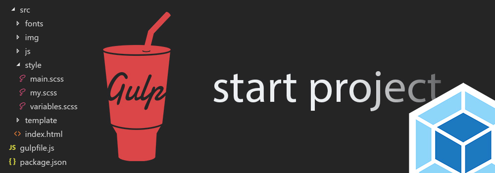

<h1>Gulp-start-tailwindcss build</h1>
											  
ПРО ЗБІРКУ
--------------------------------------------------
- Автор: Андрій Овчаров;
- Дата збірки: 04.06.2025;
- "Gulp-tailwindcss start" — це стартова збірка для веброзробників, створена спеціально для комфортної роботи з Tailwind CSS. Вона значно полегшує та пришвидшує верстку сайтів за макетами Figma завдяки вбудованим плагінам, автоматизації рутинних задач і модульній структурі проєкту.

**Збірка підтримує:** 
- Gulp: CLI version: 3.0.0
- Node JS: 22.13.1 (LTS)

ЗБІРКА ДОЗВОЛЯЄ:
-------------------------------------------------
- конвертувати файли стилів .scss у .css з підтримкою автопрефіксів;
- мініфікувати (стискати) файли .css, .js та файли зображень;
- виконувати розробку вебсайту в live-режимі з автоматичним оновленням сторінок та без кешування завдяки BrowserSync;
- конвертувати файли зображень .png та .jpg у формат .webp та .avif;
- оптимізувати файли .svg та виконувати очищення кешу зображень;
- конвертувати файли шрифтів з .ttf та .otf у .woff та .woff2, оптимізувати шрифти;
- перевіряти .css файли на помилки та відповідність стандартам за допомогою CSS Lint;
- підтримує модульну будову, розробку вебсайту з окремих компонентів;
- показує повідомлення про помилки під час компіляції стилів та скриптів.

КОМАНДИ ТЕРМІНАЛА ТА КОМБІНАЦІЇ КЛАВІШ ДЛЯ РОБОТИ З ПРОЄКТОМ:
----------------------------------------------------
1. Команди для встановлення gulp (у разі потреби):  
npm install --global gulp-cli
npm install --save-dev gulp

2. Необхідно, у разі потреби, встановити Node.js не менше версії 22.13.1. 
Інсталятор Node.js v.22.13.1 доступний за лінком: https://nodejs.org/dist/v22.13.1/node-v22.13.1-x64.msi

3. Розгорнути стартову збірку на комп'ютері: npm i
4. Запустити gulp: gulp
5. Завершити роботу gulp: Ctrl+C
6. Зібрати остаточний проєкт: gulp build 

Буде створено директорію dist, яку можна додати на хостинг.

ПЕРЕВІРКА РОБОЧОГО СТАНУ ЗБІРКИ:
----------------------------------------------------
Після розпаковки вмісту архіву у теку з проєктом необхідно розгорнути Збірку (команда: npm i) та запустити Gulp (команда: gulp).
Якщо у вікні браузера відобразиться текст привітання, то збірка працює коректно, та її можна використовувати.

РОБОТА З ФАЙЛАМИ ПРОЄКТА
---------------------------------------------------

Робота із зображеннями:
---------------------------------------------------
Всі вихідні зображення потрібно зберігати у теці app/img/src. Зображення будуть конвертовані у формат .webp та avif.
Зображення іконок svg не ковертуються, а лише стискаються. Такі зображення необхідно зберігати в окремій теці: app/img/icons. 
Після обробки, зображення іконок буде автоматично додано до теки: app/img/icons.

Робота зі шрифтами:
---------------------------------------------------
Всі вихідні шрифти у форматі .ttf та .otf необхідно зберігати у теці: app/fonts/src. Всі вони будуть конвертовані у формати: .woff та .woff2 відповідно та переміщені до теки: app/fonts. 
Для успішної конвертації шрифтів, бажано зупинити Gulp, додати шрифти до папки та повторно запустити Gulp. Конвертація шрифтів може зайняти деякий час.

Робота зі стилями css:
---------------------------------------------------
Переважна більшість вихідних стилів необхідно прописувати у файлі input.css.

Робота зі скриптами javascript:
----------------------------------------------------
Усі вихідні скрипти бажано прописувати у відповідні файли за адресою app/js. Скрипти плагінів, встановлені через npm, необхідно прописувати gulpfile.js.

Робота зі сторінками html:
----------------------------------------------------
Всі сторінки html слід зберігати за адресою: app/pages, а окремі їх компоненти (header.html, sidebar.html, footer.html та ін.) рекомендується зберігати за адресою: app/components і під'єднувати до html-сторінок, через @@include.

Наприклад: 

@@include('header.html') - під'єднуємо header.html

... код сторінки ...

@@include('footer.html') - під'єднуємо footer.html

Установка плагіна до Збірки:
---------------------------------------------------
Для встановлення нового плагіна варто ввести команду в термінал:
npm i "назва пакета" -D

Наприклад:
npm i swiper -D

Новий пакет встановлюється в папку "node_modules".

Для підключення скриптів плагіну необхідно у файлі gulpfile.js перейти до розділу "Scripts і return src([...])" та на самому початку прописати шлях до файлу js плагіна (не мініфікований). 

Приклад з плагіном "swiper".

// Scripts
function scripts() {
   return src([
     "node_modules/swiper/swiper-bundle.js", <-- рядок вказівки шляху до плагіна .js
     "app/js/main.js"
])
...
}

А файли стилів для цього плагіна краще під"єднувати через @import у файлі style.scss, де на початку пишемо:

@import '../../node_modules/swiper/swiper-bundle';

або у файлі "_libs.scss"

без розширення .css!

